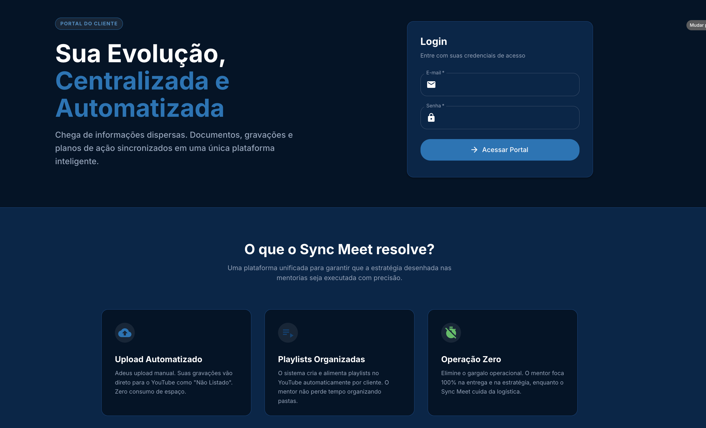

# 🚀 SyncMeet | The SessionOS for High-Ticket Mentors



**SyncMeet** is a premium, automated Mentorship & Consulting Portal designed to eliminate administrative chaos. It transforms scattered Google Drive folders, YouTube links, and Calendar invites into a unified, "Netflix-style" streaming experience for your clients.

---

## 💎 Value Proposition

### The Problem
High-ticket mentors and consultants waste hours manually organizing session recordings, managing access permissions, and sending "replay links" via WhatsApp or Email. Clients feel overwhelmed by scattered information.

### The Solution
**SyncMeet** acts as your autonomous "Session Operating System".
1.  **It Watches**: Automatically detects mentorship sessions on your **Google Calendar**.
2.  **It Organizes**: Creates a secure, private dashboard for each client.
3.  **It Delivers**: Syncs video recordings from **YouTube (Unlisted)** and documents seamlessly.

**Result**: A premium, branded portal that justifies high-ticket investment.

---

## 🔥 Key Features

- **🎨 Multi-Theme Experience**: Beautiful **Dark Mode** (Navy) and **Light Mode** (Gmail-like) interfaces, responsive and accessible.
- **📅 Zero-Touch Sync**: Automatic two-way synchronization with Google Calendar. No manual data entry required.
- **🎥 Secure Video Hub**: Integration with YouTube/Drive to stream session recordings safely without storage costs.
- **🔐 Strict Privacy (RLS)**: Enterprise-grade Row Level Security ensures clients *only* see their own data.
- **🔎 AI-Powered Summaries**: Automated generation of session titles and key takeaways (via OpenAI).
- **📱 Mobile-First Design**: Built with Material UI v7 for a native app feel on any device.

---

## 🛠️ Technical Excellence

SyncMeet is built on a modern, robust stack designed for scalability and performance.

### Core Stack
- **Frontend**: React 19, Vite 6, TypeScript 5.
- **Design System**: **Material UI v7 (MUI)** (Custom Theming, component-first architecture).
- **Backend**: Supabase (PostgreSQL, Edge Functions, Auth).
- **Infrastructure**: Docker & Docker Compose (Production-ready containerization).

### Scripts & Automation
The project leverages custom Node.js automation for dev-ops tasks:
| Script | Description |
| :--- | :--- |
| `deploy-manual.cjs` | **One-click Deploy**. Handles SFTP upload, cache clearing, and Docker rebuilds on VPS. |
| `sync-calendar.cjs` | The "Brain". Connects Google Calendar API ↔ Supabase Database. |
| `generate-summary.cjs` | AI Agent that reads raw notes and formats them into structured metadata. |

---

## 📏 Development Standards

**This project follows strict Enterprise guidelines:**
1.  **MUI First**: strict usage of `@mui/material` components (`Box`, `Stack`, `Grid`). No native HTML divs.
2.  **No Inline Styles**: All styling via `sx` prop or centralized `theme.ts`.
3.  **Type Safety**: Strict TypeScript interfaces for all Data Models (Sessions, Profiles).

---

## 🚀 Setup & Deployment

### Local Development
1.  Clone the repository.
2.  Install dependencies: `npm install`.
3.  Copy `.env.example` to `.env`.
4.  Run: `npm run dev`.

### Production Deployment
We utilize a **Manual SFTP + Docker Strategy** for maximum control:
```bash
# Deploys code, updates environment, and rebuilds containers
node scripts/deploy-manual-production.cjs
```
*Validated for DigitalOcean/Hostinger VPS environments.*

---

## 👤 Target Audience

- **Masterminds & Cohorts**: Manage groups of 50+ students with automated access.
- **1-on-1 Mentors**: Provide a VIP experience for high-value clients.
- **Consulting Firms**: Centralize deliverables and meeting history.

---

*Maintained by Start Seu*
